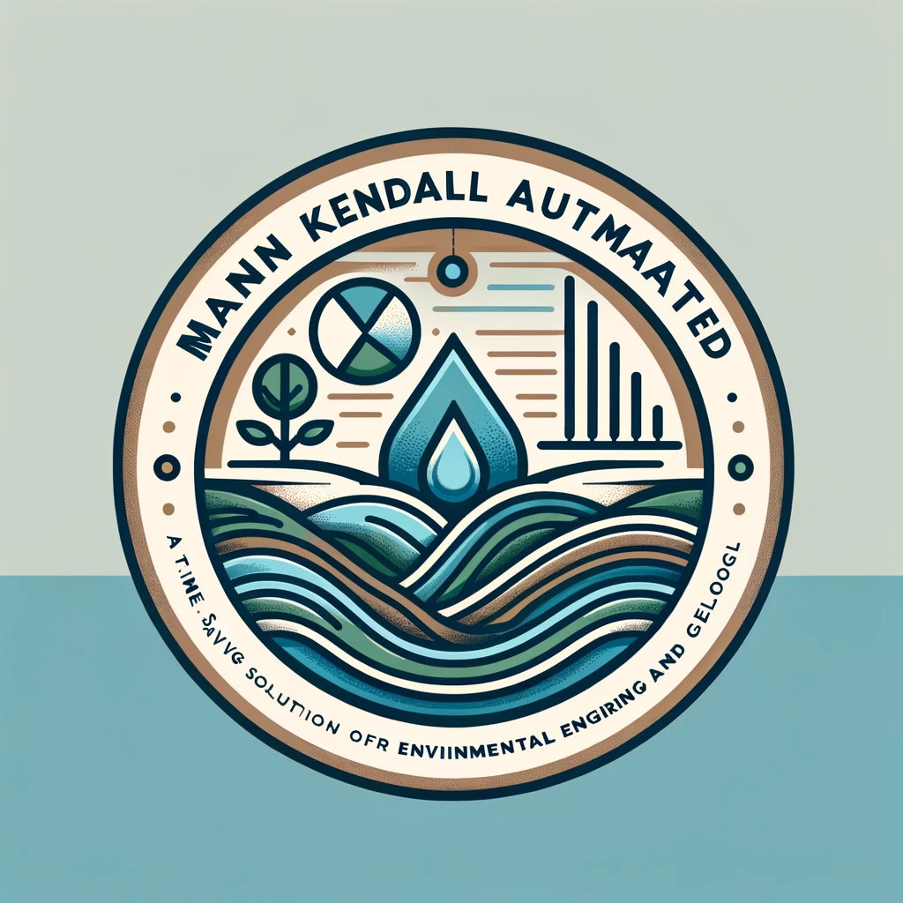

  

# Introducing Mann Kendall Automated (MKA): A Time-Saving Solution for Environmental Engineering and Geology

If you're involved in environmental engineering or geology, you're likely familiar with the Mann-Kendall test. This statistic is frequently used to identify trends in datasets, particularly in the context of water resources. But as you also know, performing these calculations can be a complex and time-consuming process. That's where Mann Kendall Automated (MKA) comes in. MKA is an online solution that automates the Mann Kendall Statistic for wells, making your work faster and more efficient.

## What is Mann Kendall Automated?

MKA is a free online tool developed to make the Mann Kendall test more accessible and easier to use. The core part of the code was made by Sat Kumar Tomer and was adapted from the GSI Spreadsheet. The result is a solution that automates one of the most commonly used statistics in environmental engineering and geology, saving you time and reducing the possibility of errors.

## How to use MKA?

Using MKA is simple and straightforward. The tool is deployed on [Streamlit Cloud](https://gabrielclimb-mann-kendall-automated-app-d8xqtm.streamlit.app/), meaning you can access it from anywhere, at any time, free of charge. All you need to provide is your data, formatted as follows:

|                   | Point Name 1 | Point name 2 |
| ----------------- | :----------: | -----------: |
| date (yyyy-mm-dd) |  2004-10-01  |   2004-11-03 |
| component         |     37.1     |         12.2 |

*You can find some examples in [*input_tables* folder](input_tables).*

If you need help formatting your data, examples are available in the input_tables folder on the MKA GitHub repository.

## Running MKA Locally

If you prefer to run MKA locally, the process is quite simple:

1. **Check Python installation**: First, make sure you have Python installed on your computer. Open your terminal and type `python --version`. This command should return the Python version installed on your computer. If Python is not installed, please visit the [Python website](https://www.python.org/) for installation instructions.

2. **Clone the MKA repository**: Use the command `git clone https://github.com/gabrielclimb/mann_kendall_automated.git` in your terminal to clone the MKA repository to your local machine.

3. **Set up a local environment**:
    - **Install virtualenv**: Virtualenv is a tool to create isolated Python environments. It can be installed via pip, Python's package installer. Type `pip install virtualenv` in your terminal and press enter to install it.
    - **Create a virtual environment**: Navigate to the directory where you want your virtual environment to be set up, and type `virtualenv .venv` in your terminal and press enter. This will create a new virtual environment in a folder named ".venv".
    - **Activate the virtual environment**: To activate the virtual environment, type `source .venv/bin/activate` in your terminal and press enter. Your terminal prompt should now indicate that you are operating within the ".venv" virtual environment.
    - **Install MKA dependencies**: With your virtual environment activated, you can now install the dependencies required for MKA. Type `pip install -r requirements.txt` in your terminal and press enter. This will install all the necessary dependencies listed in the "requirements.txt" file of the MKA repository.

4. **Run MKA**: With everything set up, you can now run MKA locally. Simply type `streamlit run app.py` in your terminal and press enter. This will start the MKA application on your local machine.

## The Benefits of Using MKA

MKA offers several benefits to its users. First and foremost, it simplifies the process of performing the Mann Kendall test, saving you precious time that can be better spent on other aspects of your work. It also minimizes the risk of errors that can occur when performing these calculations manually.

Additionally, because MKA is an online tool, it can be accessed from anywhere, offering you the flexibility to work when and where you choose. And for those who prefer to work offline, MKA can easily be run locally.

In conclusion, whether you're an experienced environmental engineer or geologist or a student just starting in the field, MKA offers a valuable tool that can make your work easier, more efficient, and more accurate.

Visit the [MKA tool](https://gabrielclimb-mann-kendall-automated-app-d8xqtm.streamlitapp.com/) or the [MKA GitHub repository](https://github.com/gabrielclimb/mann_kendall_automated) to learn more and start saving time on your Mann Kendall tests today.
